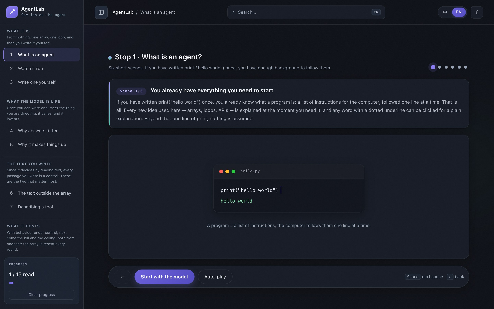
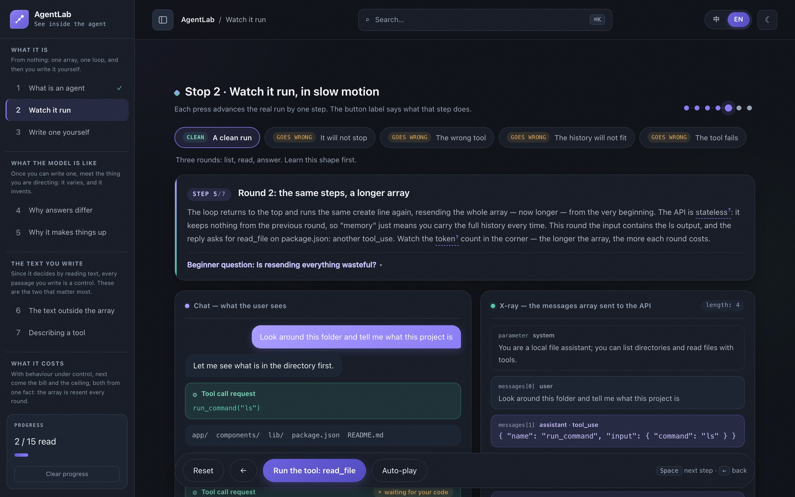

# AgentLab — An Interactive Introduction to AI Agents

[](https://github.com/renrenmimi/AgentLab/actions/workflows/ci.yml)

**▶ [Open the course](https://agent-lab-blond.vercel.app)** — runs in your browser, nothing to install.

An interactive course on tool-using AI agents. It presents the user-facing conversation
beside the `messages` array sent to the model, steps through the request, tool call, result
and follow-up loop — and then goes on to the parts that are actually hard: what a run
costs, what happens when the history stops fitting, how to describe a tool so it gets used
correctly, why a tool result cannot be trusted, and how to tell whether a change helped.



*A visual introduction to the agent loop*



*The message history growing one step at a time*

## Fifteen stops, in six groups

Fifteen stops is a path rather than a list, so the sidebar groups them and each group says
in one line why it follows the one before it. The numbers below come from position in
`lib/stops.ts`; nothing writes one down.

**What it is** · **What the model is like** · **The text you write** · **What it costs** ·
**When it goes wrong** · **How you know**

1. **`/` — What an agent is.** From "a model only turns text into text" to "a program that
   loops and calls tools", without a line of code.
2. **`/loop` — Watch it run.** Five recorded runs: one clean, and four that go wrong — a
   loop that will not stop, a model that picks the wrong tool, a history that no longer
   fits, and a tool that fails. Each failing run ends by replaying itself with the mistake
   fixed.
3. **`/build` — Write one yourself.** Eight blanks in a small agent skeleton. Each teaches
   the concept before asking; every wrong answer gets a specific correction.
4. **`/chance` — Why answers differ.** Sampling and temperature. Press *run again* and watch
   the same task take a different path. Then the consequence: an agent is not a function,
   so "it worked when I tried it" is one sample, not evidence.
5. **`/invent` — Why it makes things up.** A fluent wrong answer and a fluent right one are
   the same kind of object inside the model. Three questions, asked with and without tools —
   including one about a function that does not exist.
6. **`/instructions` — The text outside the array.** The system prompt: where it sits, that
   it is re-sent and re-paid every round, and why "I told it to be careful" is an order of
   magnitude weaker than not giving it the tool. The same task under three conditions.
7. **`/tools` — Describing a tool.** A description is a prompt, not documentation. Three
   tasks, three different omissions.
8. **`/cost` — Why it costs that.** The array is resent every round, so spending grows with
   the square of the rounds. Drag the slider and watch the curve bend.
9. **`/context` — When it will not fit.** Refuse, truncate, or summarise, all applied to the
   same conversation so you can see what each one loses.
10. **`/delegate` — Handing work to another agent.** A subagent buys context and costs you
    the ability to check its work.
11. **`/trust` — Tool output is not your friend.** Prompt injection, shown before it is
    named, then the mitigations and what each one does not stop.
12. **`/permission` — Who says yes.** The loop stops before a write and you make the call.
13. **`/again` — When a tool fails.** A call fails three ways, and in one of them you do not
    know whether the work happened — which is the one a retry does twice. Backoff, attempt
    limits, and idempotency through a concrete pair: a search and a payment.
14. **`/measure` — How you know it got better.** Ten saved tasks and a pass count.
15. **`/next` — What this course left out.** Where it stops, why, and where to go: real runs,
    frameworks, evaluation in earnest, multi-agent systems.

## Running locally

Requires Node ≥ 18.18 (an `.nvmrc` is included):

```bash
nvm use         # switch to Node 22
npm install
npm run dev     # http://localhost:3000
npm run verify  # static checks over the course content
```

## Notes on design

- **Simulated by default.** Every response comes from recorded data in `lib/scenarios/` —
  so it runs without an API key.
- **Bilingual.** Every string is a `{ zh, en }` pair in `lib/i18n.tsx`.
- **A glossary built into the prose.** Writing `[[key:label]]` renders a clickable term that
  pops up a beginner-level explanation.
- **Progress is remembered** in `localStorage` and shown in the sidebar, with a visible way to
  clear it. No account, and nothing is sent anywhere.
- **The content is checked, not just the types.** `node verify.mjs` imports the content
  modules and asserts what a content bug looks like: a pair missing one language, a step
  highlighting a line the snippet does not have, a blank with no correction for a wrong
  answer, a `[[term]]` with no glossary entry, a stop with no page behind it.
- **The behaviour is checked too.** `verify.mjs` cannot see a click. Opening any page with
  `?selftest=1` runs assertions against the live DOM — that the scenario picker is a real
  tablist, that stepping through a run and back leaves the panels where `stateAt()` says,
  that the cost slider's numbers satisfy the arithmetic the prose claims, that a wrong
  answer at stop 3 produces its own correction — plus keyboard reachability, focus rings
  and computed contrast in both themes. It prints a report, sets `document.title` to the
  score, and needs no test runner.

## Structure

Next.js 15 (App Router) + TypeScript + React 19, plain CSS. No API routes, so the site
prerenders to static pages.

| File | Role |
|---|---|
| `lib/intro.ts` | Stop 1 content |
| `lib/scenarios/` | Stop 2 — five recorded runs, frame by frame, one file each |
| `lib/<stop>.ts` | One per stop from 4 onward: the model behind it, plus its prose |
| `lib/lesson.ts` · `app/lesson.tsx` | The shared shape of a stop from 4 onward |
| `lib/stops.ts` | The reading order; the number on a stop comes from its position |
| `lib/build.ts` | Stop 3 — the blanks, answers, and per-mistake corrections |
| `lib/i18n.tsx` | Bilingual strings and the `useT()` hook |
| `lib/glossary.tsx` | Term dictionary and the `[[key:label]]` renderer |
| `lib/stops.ts` | The stop list shared by sidebar, breadcrumb, and ⌘K palette |
| `verify.mjs` | Static checks over all of the above |
| `app/selftest.tsx` · `app/selftest-suite.ts` | `?selftest=1` — the assertions a static check cannot make |

---

© 2026 Weiren Feng. All rights reserved. Published for reading and portfolio purposes; not
licensed for reuse, modification, or redistribution.
