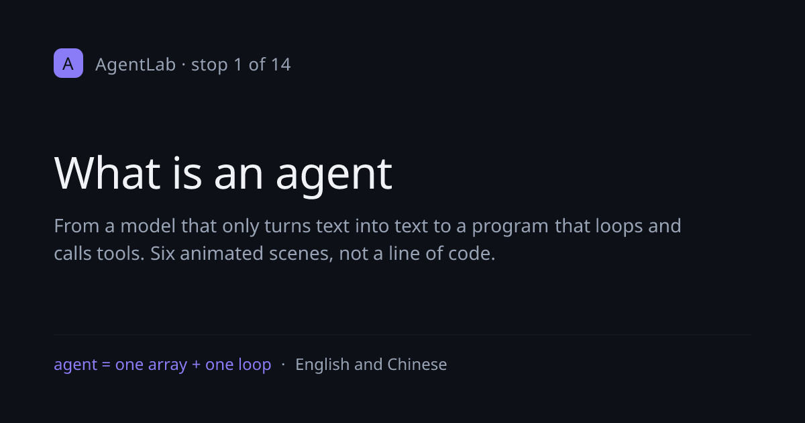

# AgentLab — An Interactive Introduction to AI Agents

[](https://github.com/renrenmimi/AgentLab/actions/workflows/ci.yml)

**▶ [Open the course](https://agent-lab-blond.vercel.app)** — runs in your browser, nothing to install.

An interactive course on tool-using AI agents, in English and Chinese. It starts from a model
that can only turn text into text and ends at the questions that actually cost people time:
what a run costs, what happens when the history stops fitting, why a model picks the wrong
tool, whether a tool result can be trusted, and how you would know that a change helped.

Fourteen stops in six groups, each group saying in one line why it follows the one before it:

| Group | What it covers |
|---|---|
| **What it is** | An array, a loop, and then you write one yourself |
| **What the model is like** | It varies between runs, and it invents |
| **The text you write** | The system prompt and the tool descriptions, and what each can actually guarantee |
| **What it costs** | Money, the context ceiling, and what to do when neither leaves room |
| **When it goes wrong** | Text that lies to it, actions that cannot be undone, calls that fail |
| **How you know** | Ten saved tasks, a pass count, and where to go next |

Every stop is something you operate rather than read: step a run forward and watch the
`messages` array grow, drag a slider until the cost curve bends, refuse a write and see how
the agent adapts, answer a question wrongly and be told which idea the mistake came from.


*Stop 2 — five recorded runs, one clean and four that go wrong*


*`/all` — the same prose in reading order, for coming back to*



*What a shared link looks like. One route draws all fifteen at `/og?s=/cost`, in the
course's own colours, with the stop number computed from `lib/order.ts` — so nothing has to
be redrawn when the order changes.*

## The stops

The numbers come from position in `lib/order.ts`; nothing writes one down.

1. **`/` — What an agent is.** From "a model only turns text into text" to "a program that
   loops and calls tools", without a line of code.
2. **`/loop` — Watch it run.** Five recorded runs: one clean, and four that go wrong — a
   loop that will not stop, a model that picks the wrong tool, a history that no longer
   fits, and a tool that fails. Each failing run ends by replaying itself with the mistake
   fixed.
3. **`/build` — Write one yourself.** Eight blanks in a small agent skeleton. Each teaches
   the concept before asking; every wrong answer gets a specific correction.
4. **`/chance` — Why answers differ.** Sampling and temperature. Press *run again* and watch
   the same task take a different path. Then the consequence: an agent is not a function,
   so "it worked when I tried it" is one sample, not evidence.
5. **`/invent` — Why it makes things up.** A fluent wrong answer and a fluent right one are
   the same kind of object inside the model. Three questions, asked with and without tools —
   including one about a function that does not exist.
6. **`/instructions` — The text outside the array.** The system prompt: where it sits, that
   it is re-sent and re-paid every round, and why "I told it to be careful" is an order of
   magnitude weaker than not giving it the tool. The same task under three conditions.
7. **`/tools` — Describing a tool.** A description is a prompt, not documentation. Three
   tasks, three different omissions.
8. **`/cost` — Why it costs that.** The array is resent every round, so spending grows with
   the square of the rounds. Drag the slider and watch the curve bend.
9. **`/context` — When it will not fit.** Refuse, truncate, summarise, or hand the work to
   another agent — the first three applied to the same conversation so you can see what each
   loses, and the fourth showing what a boundary costs: the caller gets a summary, not the
   work, and cannot check it.
10. **`/trust` — Tool output is not your friend.** Prompt injection, shown before it is
    named, then the mitigations and what each one does not stop.
11. **`/permission` — Who says yes.** The loop stops before a write and you make the call.
12. **`/again` — When a tool fails.** A call fails three ways, and in one of them you do not
    know whether the work happened — which is the one a retry does twice. Backoff, attempt
    limits, and idempotency through a concrete pair: a search and a payment.
13. **`/measure` — How you know it got better.** Ten saved tasks and a pass count.
14. **`/next` — What this course left out.** Where it stops, why, and where to go: real runs,
    frameworks, evaluation in earnest, multi-agent systems.

## What it assumes

The course used to say that beyond one line of `print("hello world")`, nothing was assumed.
That was written for a three-stop version and stopped being true a long time ago: `/build`
asks you to read a thirty-one line skeleton, `/tools` shows a JSON tool description, `/loop`
runs a code panel beside the conversation, and `/again` is about idempotency.

So here is the measured version instead. Fifteen terms have a glossary entry and are
explained where they first appear — array, loop, API, token, object, push, stateless,
`stop_reason`, `tool_result`, system prompt, sampling, temperature, context window, prompt
injection, backoff, idempotent. **Seventeen more are used without one.** `verify.mjs` holds
that list and fails if a word on it moves, or if a word joins it without being added
deliberately.

| | Words | First met at |
|---|---|---|
| **Programming vocabulary**, used as if known | 函数 / function, 变量 / variable, 字符串 / string, 布尔 / boolean, JSON, 参数 / argument, 字段 / field, 接口 / interface, 栈 / stack, 服务器 / server | `/`, `/loop`, `/build`, `/chance`, `/context` |
| **Operational vocabulary** | 缓存 / cache, 超时 / timeout, 重试 / retry, 副作用 / side effect | `/loop`, `/chance`, `/again` |
| **Domain vocabulary** the course develops by using it | 模型 / model, 提示词 / prompt, 上下文 / context | `/`, `/loop` |

What that adds up to: you need to be able to **read** a short line of code, not write one. If
you know what a function and a variable are and have seen a JSON object, nothing here will
stop you. If you have not, the third group is the one to expect trouble from, and `/build`
is where you would meet it.

Stating this is more useful than promising nothing. A course that names its prerequisites can
be checked against them, and this one is: the list above comes out of the same run that
verifies the prose.

## Coming back to it

- **[`/all`](https://agent-lab-blond.vercel.app/all) — the whole course on one page.** Every
  stop's prose in reading order, every heading anchored, so a link can point at a paragraph.
  Where a stop has something to operate, only its conclusion is kept, and that is marked. It
  prints, and it reads on a phone in one scroll.
- **Search.** ⌘K searches the stop names and the prose of all fourteen stops in both
  languages, showing which stop and which section a hit came from. The index is the same
  course view `/all` uses, flattened; it is built on the first search and there is no
  dependency and no network request.
- **The glossary keeps up.** Sixteen terms now, each declaring the stop where it first appears.
  `verify.mjs` fails if a term is defined and never marked, or marked earlier than its entry
  claims.

## Running locally

Requires Node ≥ 18.18 (an `.nvmrc` is included):

```bash
nvm use         # switch to Node 22
npm install
npm run dev     # http://localhost:3000
npm run verify  # static checks over the course content
```

Then run the in-page suite. It lives behind a flag on every page, and a committed driver
runs it in a real browser at the three widths the course is checked at:

```bash
npx next build
npm run selftest                       # all three widths, exits non-zero on a failure
npm run selftest -- --width 390        # one width
npm run selftest -- --url http://localhost:3000   # against a server you already have
CHROME_PATH=/path/to/chrome npm run selftest      # if Chrome is somewhere unusual
```

`scripts/drive-selftest.mjs` launches Chrome with a debugging port and drives it over the
DevTools protocol using the `WebSocket` built into Node 22, so it needs nothing from npm.
Opening `http://localhost:3000/?selftest=1` by hand does the same thing without the driver:
the score goes into `document.title` and the report is printed on the page and to the
console.

Both `verify.mjs` and the in-page suite declare how many assertions they hold, and fail when
the real number differs. That guard has its own test:

```bash
npm run counters   # breaks the counters five ways; fails if a break goes unnoticed
                   # the fifth needs a build and about ninety seconds
npm run prove      # reverts three shipped contrast fixes; fails if the suite misses one
```

## Notes on design

- **Simulated by default.** Every response comes from recorded data in `lib/scenarios/` —
  so it runs without an API key.
- **Bilingual.** Every string is a `{ zh, en }` pair in `lib/i18n.tsx`.
- **A glossary built into the prose.** Writing `[[key:label]]` renders a clickable term that
  pops up a beginner-level explanation.
- **Each group ends with a check.** Two or three questions that a reader who skimmed gets
  wrong, every wrong answer naming the misconception rather than saying "incorrect". No
  score, no progress percentage: the point is finding out something you thought you knew.
- **Progress is remembered** in `localStorage` and shown in the sidebar, with a visible way to
  clear it. No account, and nothing is sent anywhere.

## What is verified by what

Three things check this project, and they do not run at the same times. Knowing
which is which matters more than knowing what each one covers.

| | What it checks | When it runs |
|---|---|---|
| `node verify.mjs` | the content: bilingual pairs, line ranges, blanks, glossary markers, stop numbers, figures quoted in prose | **automatically**, in CI, every push and pull request |
| `?selftest=1`, via `npm run selftest` | the live page: roles and states, keyboard paths, contrast, headings, landmarks, the arithmetic each stop displays | **automatically**, in CI, every push and pull request |
| `npm run prove` | that the contrast check still catches defects that have already shipped | **automatically**, in CI, on `main` after a merge |
| `npm run counters` | that both files still contain the number of assertions they claim to, and that the traversal has not quietly stopped descending | by hand, or whenever either file is edited |

The second row is new. It ran by hand for five rounds, which is how the sibling
project accumulated eighteen silently failing assertions and how three contrast
defects shipped here. The workflow passes the declared totals on the command
line — `--expect-assertions 123 --expect-coverage 0.88` — rather than only
letting the suite check itself, so lowering them is a line in a diff about CI.
Zero failures is not the assertion: a run that measures less can report
everything it did measure as green.

### How contrast is measured, and why it changed

Every node that paints text is found by walking the rendered tree and measured
in place. There is no list of surfaces. There was one, for three rounds — sixty
class names typed out by hand — and this is what it did:

> It reported a perfect score while seventeen of its sixty entries matched no
> element at all. It was measuring 43 surfaces and passing 60, and three
> published contrast defects were sitting in the 17.

A selector that matches nothing is skipped rather than reported, so the list got
quieter every time a class was renamed and never said so. Traversal measures
about 207 surfaces per pass instead of 43, and roughly ten thousand across a run.

Traversal has the opposite failure: stepping over an element that is there. So
the suite asserts its own coverage. Every skip has to give one of six declared
reasons, every stop has to be measured in both themes, and two numbers have to
clear declared floors — a share and a count. The count is there because the
share cannot see a walk that stopped descending: fewer nodes found is fewer
nodes skipped as well, and the ratio does not move.

**Declared:** 123 assertions, coverage floor 0.88, and a floor on measurements of
10200 at 1200px and wider, 10100 at 700 and wider, 10000 below.

**Measured:**

| Width | Measurements | Present | Coverage | Skipped, by reason |
|---|---|---|---|---|
| 1440 | 11,259 | 12,291 | 91.6% | clipped-to-nothing 871, fully-transparent 97, disabled 64 |
| 768 | 11,111 | 12,291 | 90.4% | + not-rendered 148 |
| 390 | 11,027 | 12,291 | 89.7% | + not-rendered 232 |

`clipped-to-nothing` is the `.sr-only` pattern, `disabled` is the WCAG 1.4.3
exemption, `fully-transparent` is mostly the scenes of the opening animation that
are not the current one. The whole of the difference between 91.6% and 89.7% is
`not-rendered`: the sidebar leaving the layout at narrow widths.

`verify.mjs` fails if a list of appearance selectors reappears in the suite,
by shape rather than by name. Two mechanisms mean the stale one keeps voting.

That gap is closed, and it is worth recording what it cost while it was open.
The sibling project, AgentTape, ran the same arrangement and wrote in its CI
configuration that the suite "is run by hand before every merge." Eighteen of its
assertions then failed continuously for an entire round of work. Every CI run was
green, because CI was not running them.

This project was worse off than that. The script that drove its suite was
written as scratch and deleted, so for five merged pull requests — which folded
a stop away, renumbered the rest, moved a landmark and renamed two others — the
110 assertions did not run at all. Rebuilding that script and committing it is
what `scripts/drive-selftest.mjs` is; running it again found three contrast
failures that had shipped, on surfaces no run had ever measured.

The two projects do not share a driver. Two repositories cannot share a file
without a dependency or a submodule, and neither is worth it for a two-hundred
line script, so AgentTape keeps its own. What they share is a shape and an
environment contract: `CHROME_PATH` first and then the usual names on `PATH`, an
explicit port, a non-zero exit, and the viewport set through
`Emulation.setDeviceMetricsOverride` rather than by resizing a window.

One thing in the driver is not an implementation detail.
`Emulation.setFocusEmulationEnabled` has to be on, because a headless window is
never the focused window and `:focus-visible` never matches without it — every
focus assertion would pass while testing nothing. Its failure used to be
swallowed. On a laptop that means somebody eventually notices the focus rings are
wrong; on a runner it means nobody ever does. It is a hard error now.

## What is checked, and what is not

`node verify.mjs` reads the content modules and fails on the kinds of mistake a proofreader
misses: a bilingual pair missing one language, a step highlighting a line its snippet does not
have, a wrong answer with no correction, a `[[term]]` or `[[stop:/href]]` that resolves to
nothing, a stop number written by hand, a figure quoted in prose that disagrees with the
function that produces it.

Opening any page with `?selftest=1` runs the assertions a static check cannot make, against the
live DOM: that the tab list is a real tab list, that stepping through a run and back matches
`stateAt()`, that the cost slider's numbers still satisfy the arithmetic, that a wrong answer
in a group check shows that option's own correction and that the right answer cannot be found
in the markup. It walks the heading spine and the landmarks of all fourteen stops, checks that
every graphic is either named or hidden and that every control's name says what it does, and
computes contrast for every text-bearing node on every stop in both themes — including
pseudo-elements, SVG text, and text painted through its own background — while reporting what
share of them it reached.

**What none of that covers, and why:**

- **Screen-reader output.** What is verified is the semantics a screen reader reads — roles,
  states, names, heading order, landmarks. Whether NVDA, JAWS or VoiceOver then announce
  something a person can follow is a different question, and answering it needs those programs
  and someone who uses them daily.
- **Real touch devices.** The narrow-viewport checks run in a desktop browser at 390 px. Tap
  target sizes, momentum scrolling, and the on-screen keyboard covering an input are not
  measured.
- **Engines other than Chromium.** Everything is checked in headless Chrome. Firefox and
  WebKit are not exercised at all.
- **The prose itself.** No checker can tell whether an explanation lands. The group checks are
  the closest thing here, and they test the reader rather than the text.

## Structure

Next.js 15 (App Router) + TypeScript + React 19, plain CSS. No API routes, so the site
prerenders to static pages.

| File | Role |
|---|---|
| `lib/intro.ts` | Stop 1 content |
| `lib/scenarios/` | Stop 2 — five recorded runs, frame by frame, one file each |
| `lib/<stop>.ts` | One per stop from 4 onward: the model behind it, plus its prose |
| `lib/lesson.ts` · `app/lesson.tsx` | The shared shape of a stop from 4 onward |
| `lib/stops.ts` | The reading order; the number on a stop comes from its position |
| `lib/build.ts` | Stop 3 — the blanks, answers, and per-mistake corrections |
| `lib/i18n.tsx` | Bilingual strings and the `useT()` hook |
| `lib/glossary.tsx` | Term dictionary and the `[[key:label]]` renderer |
| `lib/stops.ts` | The stop list shared by sidebar, breadcrumb, and ⌘K palette |
| `lib/checks.ts` · `app/group-check.tsx` | The check at the end of each of the six groups |
| `lib/course.ts` | One shape for every stop's prose; `/all`, search and the checker share it |
| `lib/search.ts` | The index and the query, built from `lib/course.ts` |
| `lib/order.ts` | The reading order, as bare hrefs, with no imports |
| `lib/meta.ts` | Per-stop title and description, written one at a time |
| `app/og/route.tsx` | One route, fifteen share cards, no dependency |
| `verify.mjs` | Static checks over all of the above |
| `scripts/drive-selftest.mjs` | Runs `?selftest=1` in a real browser and reports the score |
| `scripts/check-the-counters.mjs` | Breaks both assertion counters on purpose and fails if a break goes unnoticed |
| `scripts/prove-contrast-catches.mjs` | Puts shipped contrast defects back and fails if the suite does not notice |
| `app/selftest.tsx` · `app/selftest-suite.ts` | `?selftest=1` — the assertions a static check cannot make |

---

© 2026 Weiren Feng. All rights reserved. Published for reading and portfolio purposes; not
licensed for reuse, modification, or redistribution.
